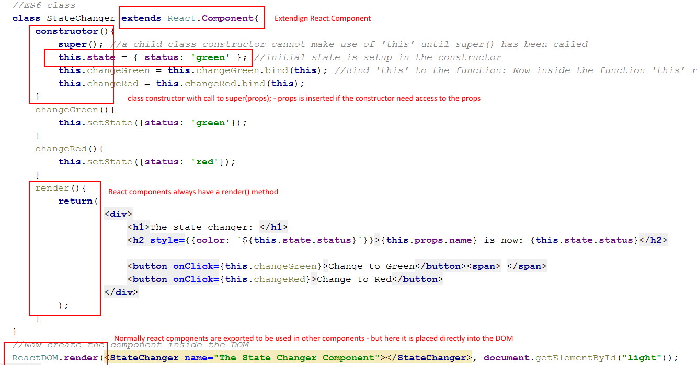

# Week 8: React JS

ReactJS is a component based javascript library, that helps us write better and faster javascript applications frontend.

##### Possible alternatives:

- Angular2 (or AngularJS), Vue, Ember.js and even jQuery and many more. Some are libraries some are full grown frameworks

### Topics
| Topic                                | Content                                  | Resource                                 |
| ------------------------------------ | ---------------------------------------- | :--------------------------------------- |
| 1. SPA architecture                  | why do we need js frameworks?            | [Video: 52 mins](https://www.youtube.com/watch?v=vXjVFPosQHw)<br/>,          [Article](https://blog.poki.com/front-end-walkthrough-building-a-single-page-application-from-scratch-d47c35fdc830) |
| 2. node and npm/yarn                 | Installation and use of node + yarn      | [video: 8 mins](https://www.youtube.com/watch?v=7n467QmiANM)<br/>,          [yarn improves on npm](https://scotch.io/tutorials/yarn-package-manager-an-improvement-over-npm#toc-installing-yarn) |
| 3. ES6                               | classes, arrow notation, destructuring arrays and objects, template strings, let & const, babel light | [Video: watch 0:42.41](https://www.youtube.com/watch?v=hO7mzO83N1Q)<br/>,  [Simple ES6 tutorial](http://qnimate.com/post-series/ecmascript-6-complete-tutorial/) |
| 4. This keyword                      | The 'this' keyword and how its used in javascript. | [The 'this' keyword](http://reactkungfu.com/2015/07/why-and-how-to-bind-methods-in-your-react-component-classes/) |
| 5. What problem does React.js solve? | 1. DOM manipulation is an expensive operation and should be minimized.  2. Code reuse with components.    3. Represent state and update state (better to not update but rerun the whole program again - can be expensive though: thus the virtual DOM) | [Some good points here](https://www.quora.com/What-does-react-js-try-to-solve-Can-you-provide-a-practical-example) |
| 6. React.JS                          | Component, [State and props](demo/propsDemo), Events, List and Keys, Forms, functional components | [React intro](https://reactjs.org/docs/hello-world.html)<br/>,   [JSX](https://reactjs.org/docs/introducing-jsx.html)<br/>,      [Rendering](https://reactjs.org/docs/rendering-elements.html)<br/>,  [Components and props](https://reactjs.org/docs/components-and-props.html)</br>, [Forms](https://reactjs.org/docs/forms.html), |
| 7. Create-react-app                  | A program to set up your react application with babel and webpack: Removes a lot of initial configuration | [Create-react-app tutorial](https://medium.com/@diamondgfx/learning-react-with-create-react-app-part-1-a12e1833fdc) |
| 8. Lifecyckle methods                | componentWillMount, componentWillReceiveProps etc. | [When and why](https://engineering.musefind.com/react-lifecycle-methods-how-and-when-to-use-them-2111a1b692b1) |
| 9. React with router                 | react-router                             |                                          |
| 10. React with backend               | json-server (locally), rest api backend  |                                          |

#### First example




#### 2 important tutorial guides

This week is build around Facebooks [tutorial docs here](https://reactjs.org/docs/hello-world.html)

And Eggheads [video tutorials here](https://egghead.io/lessons/react-react-fundamentals-development-environment-setup). **Videos are great** if you use it for inspiration to immediately start coding - trying out the things from the video (Else they are mostly a **waste of time**).

### Rough plan

Day 1: [ES6 features](http://qnimate.com/post-series/ecmascript-6-complete-tutorial/) - Why react? - The basic structure of a react class and [rendering](https://reactjs.org/docs/rendering-elements.html) - quick intro to create-react-app

Day 2: [JSX](https://reactjs.org/docs/introducing-jsx.html) - [Components and props](https://reactjs.org/docs/components-and-props.html) - [Small demo project](/demo/propsDemo) - [Events](https://reactjs.org/docs/handling-events.html) - 

Day 3: [Forms](https://reactjs.org/docs/forms.html) - [Controlled components](https://reactjs.org/docs/forms.html#controlled-components) - [List and keys](https://reactjs.org/docs/lists-and-keys.html) - [State and lifecycle methods](https://reactjs.org/docs/state-and-lifecycle.html) - [Lifting state up](https://reactjs.org/docs/lifting-state-up.html).

Day 4: Data storage (Mobx light: datamapning mod server. One file pr. REST resource.) 

Day 5: Todolist laves om til shopping list + 2 * exam prep assignments

Day 6: Summing up and Router continued.

Day 7: Router continued + seed.

Day 8: Native

Day 9: Native

Day 10: Exam prep with native + shopping list native.


### Exercises

[Day 1 exercise](https://docs.google.com/document/d/1mCDQgNCKxZwO6cx2FyhwK6-srgZCVVvYCTFGXglrhpg/edit?usp=sharing)   
[Day 2 exercise](https://docs.google.com/document/d/1OGHsWR8gvubw4R64GBEQqkiPxZutxmWFsd7Ac5z0ygg/edit?usp=sharing)   
[Day 3 exercise](https://docs.google.com/document/d/15oxKKJXSJ1uju8wmRJNXnSE2QuegfwL-Rm3dmtBOhfw/edit?usp=sharing)   
[Day 4 exercise](https://docs.google.com/document/d/1cKgFbuaoCV3J001uxSFLe7iw6gfDOIhuQKGG0hfWze4/edit?usp=sharing)   
[Day 5 SP exercise](https://docs.google.com/document/d/11s2j4S8jpg0X41ARuxC3jgkvD5ikKL8FOqoCBVNNspI/edit?usp=sharing)     

#### Further Readings

[For those who like a (free) book](https://leanpub.com/the-road-to-learn-react)
[For those who like a video](https://egghead.io/lessons/react-react-fundamentals-development-environment-setup) 
[NPM cheat sheet](study/npm_cheat_sheet.md) 
[About React](https://facebook.github.io/react/)
[About create-react-app](https://github.com/facebookincubator/create-react-app#getting-started)  
[create-react-ap tutorial](https://medium.com/@diamondgfx/learning-react-with-create-react-app-part-1-a12e1833fdc)  
[About Webpack for React](http://www.pro-react.com/materials/appendixA/)

### Install node (and NPM)

First we need a javascript runtime engine. We will use Node.js. Install it from here:  
[Get node.js](https://nodejs.org/en/).   
This will also give us the Node Package Manager (npm) that we will use to install other javascript packages in our projects and globally.

When we are running javascript inside the browser, we do not need node.js (the engine). When we want to run javascript outside the browser we need node.js.

### Install 'create-react-app'

When we are making react apps and using EcmaScript6 features most browsers will not understand. Therefore we have to transpile our scripts to EcmaScript5. In order to do that we will use Babel. To minimise the configuration for our react apps we will use a fully integrated project - a react template project: [Facebooks "create-react-app"](https://github.com/facebookincubator/create-react-app#getting-started).   

1. Scroll down the readme file and get to know the application.

2. Open a console like git bash.

3. write: `npm install -g create-react-app` to install create-react-app globally on your computer.    

4. Then go to a folder location where you want to start your first React project and write: `create-react-app <appname>` and `cd <appname>` to move inside the new app folder.

5. Now checkout the projects folder structure:  

   

6. Look particularly on App.js, index.js and index.html  
7. Try changing the content inside App.js so that it says: Welcome to my new React application.
8. From the commandline (inside the app) run: `npm start`  
9. Go to a browser on: `http://localhost:3000` and see the app running here.  
10. Checkout the [package.json file](https://github.com/facebookincubator/create-react-app/blob/master/package.json) to see how dependencies are managed in the project.  

### Upload to github

When uploading projects based on create-react-app then make sure to write in the .gitignore file:

```
**/node_modules/
```

This folder holds all the npm dependencies and should not be shared over github/dropbox or any other way.

When we clone or download a project like that, we start the project by running:

```
npm install
```

from the console. 

This will download all the dependencies to the project.