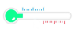
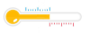
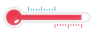

#Exercise Day 1: React basic app and ES6 features
##Create a gallery
| Level                     | Task                                     |
| ------------------------- | ---------------------------------------- |
|   | 1. Look at the example in [basic.html](exercises/Ex1/basic.html). |
|                           | 2. Copy that file and call it: "gallery.html" |
|                           | 3. Change the props text so that it can describe the type of gallery you are making (e.g: speedboats or horses or...) |
|                           | 4. change one of the methods (changeGreen and ChangeRed) so that they can change the writing to a random text from an array of quotes. |
|                           | 5. Add 1 more button so that you have 3 buttons in total |
|  | 6.  change the methods so that you can show a different picture, depending on which button is clicked.  Hint:  use require to make static import of images: `` |
|                           |                                          |
|     | 7. Try and see if you can make your app work with just one button (when clicked it should show the next image allways). |
|                           | 8. Now move your application into a create-react-app. Do it in a way that your gallery becomes a component, that is loaded into App.js |

## Run an on-line tutorial:

[Create a todo list application in react](https://medium.com/codingthesmartway-com-blog/the-2017-react-development-starter-guide-f717e4e13de7) 

