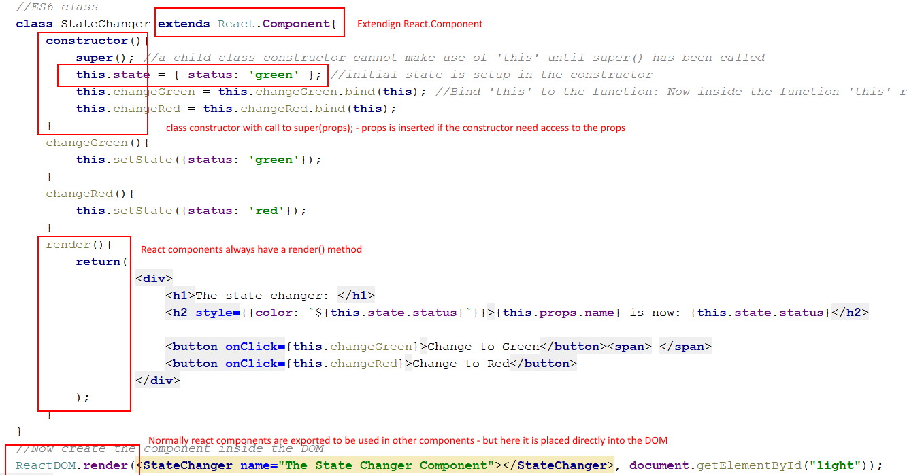

# Week 8: React JS and Single Page Application (SPA)

ReactJS is a component based javascript library, that helps us write better and faster javascript applications in the frontend.
### Business competences

Demands for skills related to JavaScript and Single Page Applications has increased over the last years 
- [ref. it.jobindex.dk - JavaScript](https://it.jobindex.dk/jobsoegning?q=javascript&supid=1).
- [ref. it.jobindex.dk - React]( https://it.jobindex.dk/jobsoegning/it?q=react).

JavaScript, and React this semester, will provide students with the background to join modern front-end teams, using JS and supplementing JS frameworks like React

##### Possible alternatives are:

- Angular2 (or AngularJS) 
- Vue
- Ember.js 
- jQuery 
 
 and many more. Some are libraries some are full grown frameworks

## Plan
|Day|Do before class|Topic|Exercises|
|-----------|---------|----|-------|
|[Day 1](path/to/slide/here)|[create_react_app quick](create_react_app.md)|SPA,  [ES6 features](http://qnimate.com/post-series/ecmascript-6-complete-tutorial/),  [create-react-app](https://github.com/facebookincubator/create-react-app#getting-started),  [rendering](https://reactjs.org/docs/rendering-elements.html),  [JSX](https://reactjs.org/docs/introducing-jsx.html),  [Components and props](https://reactjs.org/docs/components-and-props.html) |[Day 1 exercise](https://docs.google.com/document/d/1mCDQgNCKxZwO6cx2FyhwK6-srgZCVVvYCTFGXglrhpg/edit?usp=sharing)   |
|Day 2||[State](https://reactjs.org/docs/state-and-lifecycle.html),  [Lifting state up](https://reactjs.org/docs/lifting-state-up.html),   [Events](https://reactjs.org/docs/handling-events.html),  [List and keys](https://reactjs.org/docs/lists-and-keys.html),  [Forms](https://reactjs.org/docs/forms.html), [Controlled components](https://reactjs.org/docs/forms.html#controlled-components)  |[Day 2 exercise](https://docs.google.com/document/d/1OGHsWR8gvubw4R64GBEQqkiPxZutxmWFsd7Ac5z0ygg/edit?usp=sharing)   |
|Day 3|Look at this [jsonserver quick demo](jsonserver.md), AND   [surge deploy](quick_deployment.md)| MobX light,  AJAX fetch,  Deployment,  JSON server |[Day 3 exercise](https://docs.google.com/document/d/15oxKKJXSJ1uju8wmRJNXnSE2QuegfwL-Rm3dmtBOhfw/edit?usp=sharing)  AND / OR   [Day 4 exercise](https://docs.google.com/document/d/1cKgFbuaoCV3J001uxSFLe7iw6gfDOIhuQKGG0hfWze4/edit?usp=sharing)    |
|FRIDAY SP6|| Exercises |[SP exercise](https://docs.google.com/document/d/11s2j4S8jpg0X41ARuxC3jgkvD5ikKL8FOqoCBVNNspI/edit?usp=sharing)  |
|Day 1 |Complete this [simple React Router v4 Tutorial](https://medium.com/@pshrmn/a-simple-react-router-v4-tutorial-7f23ff27adf) and **read** the text. Skim [this video](https://reacttraining.com/react-router/)|[React Router Docs](https://reacttraining.com/react-router/web/guides/philosophy)|[Exercises day 1](https://docs.google.com/document/d/1o-VeUXFtrMHvkQ6HfuwHHgefiviFk1Uu_5BcpSsPWFg/edit?usp=sharing)|
|Day 2 ||JSON Web Tokens (JWT)|[Exercises Day 2](https://docs.google.com/document/d/1c-yHpIyWqiH0PNKoW6IAGUJi7OLe8v0wRiivXd0pgfM/edit?usp=sharing)|
|Day 3 |Watch this video [Why React Native Is Such A Big Deal](https://www.youtube.com/watch?v=CAc_PAbJkVU) and this [Expo Explained in 2 Minutes](https://www.youtube.com/watch?v=IQI9aUlouMI)|[React Native](https://facebook.github.io/react-native/) and [Expo](https://docs.expo.io/versions/latest/index.html),  [Native getting started](https://facebook.github.io/react-native/docs/getting-started.html)|[Exercises Day 3](https://docs.google.com/document/d/1Rno9-x_B4dJwEDonpDpcq-gY3EjSxf9Lt42s9GKpYDE/edit?usp=sharing)|
|Day 4 |Skim all the cool expo [examples](https://docs.expo.io/versions/latest/sdk/video.html)|React Native med rest api|[Exercises Day 4](https://docs.google.com/document/d/1cVH97IJEQhWTh1G4Dn-nqqUKIg2qjidx0Nt50qITb3c/edit?usp=sharing)|
|FRIDAY SP7|||[SP7](https://docs.google.com/document/d/1i961CadjDO3nWpjhDkNkvW9RtL6MuLfMe10SkBXqbeQ/edit?usp=sharing)|
|Monday review||Review for the past 2 weeks|

## Resources: 

- The main resource is [reactjs.org]( https://reactjs.org/). Don't focus on the tutorial (it's absolutely not for beginners), but on the [Docs]( https://reactjs.org/docs/hello-world.html). This is the real tutorial.
- We recommend (very much) that you watch, and code along this [Video Tutorial]( https://egghead.io/lessons/react-react-fundamentals-development-environment-setup). You should have completed the video before Friday
- If you like books, this [free book]( https://leanpub.com/the-road-to-learn-react) is recommended

### Topics
| Topic                                | Content                                  | Resource                                 |
| ------------------------------------ | ---------------------------------------- | :--------------------------------------- |
| 1. SPA architecture                  | why do we need js frameworks?            | [Video: 52 mins](https://www.youtube.com/watch?v=vXjVFPosQHw) ,          [Article](https://blog.poki.com/front-end-walkthrough-building-a-single-page-application-from-scratch-d47c35fdc830) |
| 2. node and npm/yarn                 | Installation and use of node + yarn      | [video: 8 mins](https://www.youtube.com/watch?v=7n467QmiANM) ,          [yarn improves on npm](https://scotch.io/tutorials/yarn-package-manager-an-improvement-over-npm#toc-installing-yarn) |
| 3. ES6                               | classes, arrow notation, destructuring arrays and objects, template strings, let & const, babel light | [Video: watch 0:42.41](https://www.youtube.com/watch?v=hO7mzO83N1Q) ,  [Simple ES6 tutorial](http://qnimate.com/post-series/ecmascript-6-complete-tutorial/) |
| 4. This keyword                      | The 'this' keyword and how its used in javascript. | [The 'this' keyword](http://reactkungfu.com/2015/07/why-and-how-to-bind-methods-in-your-react-component-classes/) |
| 5. What problem does React.js solve? | 1. DOM manipulation is an expensive operation and should be minimized.  2. Code reuse with components.    3. Represent state and update state (better to not update but rerun the whole program again - can be expensive though: thus the virtual DOM) | [Some good points here](https://www.quora.com/What-does-react-js-try-to-solve-Can-you-provide-a-practical-example) |
| 6. React.JS                          | Component, [State and props](demo/propsDemo), Events, List and Keys, Forms, functional components | [React intro](https://reactjs.org/docs/hello-world.html) ,   [JSX](https://reactjs.org/docs/introducing-jsx.html) ,      [Rendering](https://reactjs.org/docs/rendering-elements.html) ,  [Components and props](https://reactjs.org/docs/components-and-props.html) , [Forms](https://reactjs.org/docs/forms.html), |
| 7. Create-react-app                  | A program to set up your react application with babel and webpack: Removes a lot of initial configuration | [Create-react-app tutorial](https://medium.com/@diamondgfx/learning-react-with-create-react-app-part-1-a12e1833fdc) |
| 8. Lifecyckle methods                | componentWillMount, componentWillReceiveProps etc. | [When and why](https://engineering.musefind.com/react-lifecycle-methods-how-and-when-to-use-them-2111a1b692b1) |
| 9. React with router                 | react-router                             |                                          |
| 10. React with backend               | json-server (locally), rest api backend  |                                          |

#### First example

#### 2 important tutorial guides

This week is build around Facebooks [tutorial docs here](https://reactjs.org/docs/hello-world.html)

And Eggheads [video tutorials here](https://egghead.io/lessons/react-react-fundamentals-development-environment-setup). **Videos are great** if you use it for inspiration to immediately start coding - trying out the things from the video (Else they are mostly a **waste of time**).

#### Further Readings

[For those who like a (free) book](https://leanpub.com/the-road-to-learn-react)  
[For those who like a video](https://egghead.io/lessons/react-react-fundamentals-development-environment-setup)  
[NPM cheat sheet](study/npm_cheat_sheet.md) 
[About React](https://facebook.github.io/react/)
[create-react-ap tutorial](https://medium.com/@diamondgfx/learning-react-with-create-react-app-part-1-a12e1833fdc)  
[About Webpack for React](http://www.pro-react.com/materials/appendixA/)

#### Extra exercises

[Used cars exercise part 1](Ex1/UsedCarsEx1.md)  
[Used cars exercise part 2](Ex1/UsedCarsEx2.md)  
[Used cars exercise part 3](Ex1/UsedCarsEx3.md)  
[Used cars exercise part 4](Ex1/UsedCarsEx4-backend.md)  
[Routing with parameters](Ex1/RoutingWithParameters.md)  